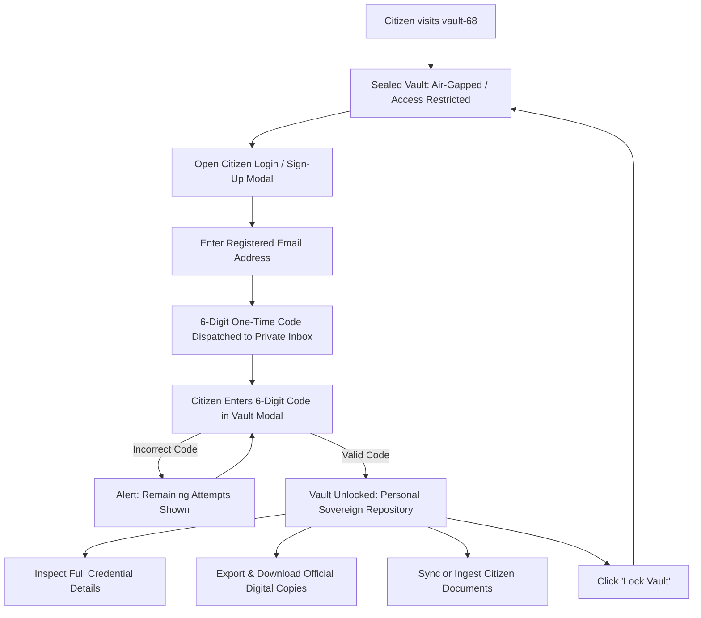

# vault-68: Sovereign Citizen Document Repository

**vault-68** is a secure, personal digital document vault designed to empower citizens with sovereign control, privacy, and instant access to their official legal credentials. Inspired by modern citizen locker systems, vault-68 allows users to store, view, verify, and export official government records—such as national identity cards, tax credentials, driver's licences, and academic certificates—all within an intuitive, privacy-first interface.

---

## What vault-68 Does (User Perspective & Functional Capabilities)

### 1. Dual-State Privacy: Sealed Vault vs. Authenticated Repository
* **Sealed Vault Architecture**: When you first open vault-68 or when you are not logged in, document preview cards and dummy specimens are completely disabled. All citizen credentials remain strictly air-gapped and sealed behind zero-knowledge cryptographic locks. Unauthenticated visitors see only the sealed vault security console with verification prompts.
* **Instant Decryption Upon Sign-In**: Once authenticated via Resend email OTP, the vault securely unlocks and renders the citizen's personal credentials stored in Supabase PostgreSQL, unlocking full verification inspection and export privileges.

### 2. Passwordless Email OTP Authentication
* **No Passwords to Remember or Leak**: vault-68 eliminates static passwords. You never have to create, remember, or reset complex passwords that could be vulnerable to data breaches.
* **Direct Inbox Verification**: Simply enter your registered email address. A confidential 6-digit verification code is dispatched straight to your private email inbox.
* **Zero-Leakage Privacy**: The sent verification code is strictly confidential and delivered only to your inbox—it is never shown on the screen or in preview banners, protecting your access from anyone looking over your shoulder.
* **Quick Sign-Up for New Citizens**: New citizens can register in seconds by providing their full legal name and email address.

### 3. Interactive Legal Credential Inspection
* **Comprehensive Credential Profiles**: Clicking **Inspect** on any document opens a dedicated examination modal displaying official issuing metadata.
* **Rich Verification Metadata**: Review document-specific data points such as:
  * Official Issuing Body (e.g., UIDAI, Income Tax Department, CBSE)
  * Registered Holder Full Legal Name
  * Date of Birth (DOB) and Residential Records
  * Academic Year, Institution, and Passing Status
* **Authenticity Indicators**: Clear visual indicators verify that the credential has been authenticated by the appropriate governmental authority.

### 4. Official Document Export
* **Downloadable Legal Records**: Citizens can instantly export and download standardized legal digital text copies of any credential with a single click.
* **Offline Readiness**: Exported documents contain the issuing body, holder information, verification status, and record timestamps—ready to be printed, attached to employment applications, or presented during official administrative procedures.

### 5. Document Ingestion & National Ledger Sync
* **Govt-Linked Ingestion**: Synchronize official documents directly with UIDAI, Income Tax Department, and CBSE into Supabase.
* **Custom Document Upload**: Citizens can add and secure additional legal documents beyond standard identity cards.
* **User-Defined Details**: Specify the document title (e.g., Passport, Property Deed, Health Insurance Policy), the issuing authority, and the registration or serial number.

### 6. Real-Time Document Search and Filtering
* **Instant Keyword Filtering**: Quickly locate specific documents among stored credentials once authenticated.
* **Multi-Field Search**: Filter seamlessly by document title (e.g., *"Aadhaar Card"*), short code (e.g., *"PAN"*), or issuing authority (e.g., *"Income Tax Department"*).

### 7. Instant One-Click Vault Lock
* **Rapid Session Sealing**: When you finish viewing or exporting your documents, click **Lock Vault** to instantly re-seal your repository.
* **Zero Residual Exposure**: Locking the vault immediately purges active session credentials from client memory and returns the screen to the sealed vault console.

---

## User Journey & Workflow Summary

---

## Key Privacy and Usability Guarantees

| Feature | Citizen Benefit |
| :--- | :--- |
| **Masked Public View** | Protects your personal data from prying eyes in public spaces, offices, or shared computers. |
| **Passwordless Login** | Eliminates weak, reused, or forgotten passwords; access is tied securely to your verified email. |
| **Confidential Code Delivery** | Verification codes are delivered directly to your inbox and never exposed in the browser interface. |
| **Instant Export** | Provides portable, offline-accessible digital credentials whenever official proof is required. |
| **One-Click Sealing** | Ensures you can leave your workstation without leaving sensitive identity documents unmasked. |
